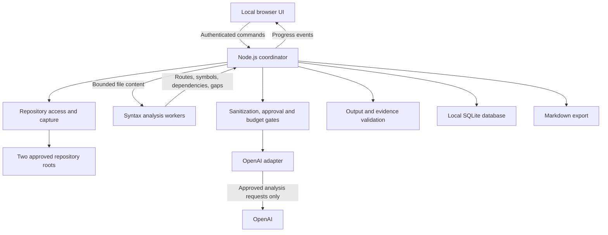

# AI API Migration Reviewer — MVP Architecture

Status: Approved architecture approach, documented at the user's request. This is an architecture document, not an implementation plan.

Requirements baseline: [requirements.md](requirements.md). The requested `docs/product-requirements.md` was not present; the approved approach used the finalized `docs/requirements.md`. The original draft is not the governing specification.

## 1. Architectural decision and scope

Use a **modular local Node.js agent with analysis workers**, serving a browser-based local UI. The agent owns permissions, orchestration, provider access, persistence, and review state. Workers perform bounded syntax analysis and indexing on file content supplied by the agent.

The MVP supports conventional Lumen 11.0 to NestJS 11.0.1 migrations, JSON REST APIs, two selected repositories, and batch reviews with manually defined split/merged mappings. It analyzes current files, including uncommitted changes, without executing repository code. AI outputs remain provisional until human verification.

Alternatives considered:

| Approach | Benefit | Reason not selected |
| --- | --- | --- |
| Single execution-thread application | Minimal coordination and simpler debugging | Parsing could delay local UI requests, cancellation, and progress reporting. |
| Modular agent with workers | One installed application, responsive coordination, separate framework analysis | Selected; requires explicit worker contracts and failure handling. |
| Coordinator with separate analyzer processes | Better process-level crash containment and independent analyzers | Adds supervision, packaging, and cross-platform complexity for the internal pilot. |

Workers are not an operating-system security sandbox. The design relies on application-owned parsers, bounded inputs, and coordinator-enforced capabilities. It never loads project plugins, imports application modules, or evaluates repository expressions.

## 2. Runtime topology

A terminal command starts one local agent and serves bundled UI assets. The agent binds to `127.0.0.1`. UI commands use authenticated local HTTP requests; server-sent events deliver progress. Persistent state remains authoritative when a UI reconnects; events are notifications rather than the only record of work.

The coordinator supervises a bounded worker pool. Parsing jobs carry IDs, review versions, and limits. Worker timeouts or failure affect the relevant job; the agent retains control of cancellation and storage. The initial scheduler can process review groups serially while allowing bounded parsing work. Correctness and budget admission must not depend on concurrency.

No external database, message broker, hosted dashboard, or independently installed analyzer service is required.

## 3. Module boundaries and ownership

| Module | Owns | Must not own |
| --- | --- | --- |
| Local transport/session | Browser authentication, request validation, progress delivery | Model judgment or direct repository traversal |
| Review coordinator | Batch/group state, cancellation, explicit retries, work admission | Framework-specific parsing |
| Repository access | Root validation, exclusions, safe reads, capture identity | Provider transmission or repository writes |
| Analysis workers | PHP/TypeScript syntax, symbols, supported route/dependency facts | Secrets, provider keys, network requests, persistent state |
| Framework adapters | Lumen and NestJS resolution rules, unresolved-pattern reporting | Execution of application/framework commands |
| Mapping service | Deterministic matches, user-defined groups and correspondence | AI-approved mappings or inferred runtime equivalence |
| Context service | Selected-group dependency traversal, manifests, limits, rediscovery | Unapproved outbound sharing |
| Secret protection | Detection, redaction/exclusion, output/export checks | Claims of perfect detection |
| Approval service | Exact sanitized-content approvals, exception approval versions | Expanding approval because AI requests it |
| Budget ledger | Pricing version, reservations, reconciliation, admission | Provider keys or automatic forgiveness of unknown charges |
| OpenAI adapter | Validated-model requests, bounded output, usage/error normalization | Filesystem tools, autonomous execution, automatic paid retries |
| Evidence validator | Output structure, captured-reference validity, failure isolation | Certifying semantic correctness |
| Findings/scenarios | Provisional findings, human dispositions, edited suggestions | Runtime execution or automatic defect closure |
| Persistence/export | Transactional records, deletion, Markdown previews/exports | Writing into reviewed repositories |

Modules exchange explicit data contracts, not shared mutable review objects. The coordinator is the only writer of lifecycle transitions. Workers return facts and diagnostics; provider output is untrusted input to validation. Only recorded user actions establish human verification and intentional exceptions.

## 4. Local UI and session security

The UI supports project selection, endpoint inventory, mapping-group editing, sanitized context approval, budgets, finding triage, scenario editing, history, and export preview. It has no direct filesystem or provider access.

Startup presents a short-lived, single-use browser bootstrap credential. The browser exchanges it for an authenticated local session and removes it from the displayed URL. API credentials are entered separately in a masked field and sent to the agent; they are not placed in browser persistent storage, URLs, logs, or SQLite. The agent retains the OpenAI key in memory until shutdown or replacement.

All protected commands and event connections require session authentication. The transport validates Host and Origin, rejects unapproved origins, and protects state-changing requests against cross-site submission. Bundled assets require no remote scripts or resources. The local browser session is separate from the provider-key session.

Closing a tab does not stop the agent: already approved work may continue within its budgets. Pending approvals remain pending. Restart requires a new browser bootstrap and provider-key entry and does not resume paid work automatically.

This protects against unauthorized local HTTP callers and hostile browser pages. It is not a promise of isolation from an administrator or another process already able to inspect the user's process memory.

## 5. Filesystem access and captured evidence

Repository inputs, application storage, and export destinations have distinct permissions:

- Repository reads are limited to the two explicitly selected roots. Resolve paths and enforce containment at read time; reject traversal, escaping symbolic links, unsupported file types, and excluded content. Do not execute Git hooks or application commands to identify source versions.
- Application-owned storage resides outside the reviewed roots. Repository access remains read-only even if a user chooses an export destination within one of them; reject that destination.
- Export writes are limited to a destination explicitly chosen by the user. Export permission never grants context-read permission.

The repository service supplies bounded file content to parsers. Raw source is transient local input; only sanitized review context is retained as evidence or transmitted. Capture records retain repository-relative paths, content fingerprints, source spans, and stable symbol references. Redaction maintains a source-span mapping so sanitized citations remain attributable without retaining detected secrets.

A manifest identifies a captured context version, mapping-description version, exclusions, limits encountered, and unresolved dependencies. If files change during collection, recollect affected inputs rather than silently combine detected inconsistent versions. The application does not claim an atomic snapshot of concurrently edited repositories.

Before analysis, completion, and reopening, rediscover supported routes and dependencies. Compare additions, deletions, renames, configuration/registration inputs, and captured file versions. Changes invalidate affected current results and exception approvals. If impact cannot be established, freshness is unverifiable; historical evidence remains available.

## 6. Lumen and NestJS endpoint discovery

Both adapters translate syntax-derived facts into a common endpoint inventory: repository identity, HTTP method, normalized route pattern, handler reference, source location, framework, and resolution diagnostics.

### Lumen

A PHP syntax parser recognizes the pilot's supported route declarations and groups, literal prefixes and methods, handler references, middleware declarations, and statically resolvable calls. It indexes class and method declarations and traverses supported service/database patterns.

It does not boot Lumen, run PHP, invoke framework route commands, execute route files, or resolve arbitrary computed expressions by evaluation. Dynamic registration, unsupported container resolution, and excluded dependency behavior produce explicit gaps.

### NestJS

A TypeScript syntax parser recognizes supported controller and method decorators, route arguments, registration paths, guards, validation references, and statically resolvable service relationships. It links controller methods to DTOs, services, response transformations, and database calls where supported.

It does not import TypeScript/JavaScript application modules, execute decorators, start NestJS, or run repository-supplied compiler plugins. Computed metadata and unsupported dynamic module behavior remain unresolved.

Exact parser packages and supported framework-pattern rules must be validated against the pilot inventory before discovery/tracing implementation. The adapters must not promise all framework behavior merely because a project reports a supported version. Missing discovery results are inventory observations, not proof that an endpoint is absent.

## 7. Mapping and selected-API context

Deterministic matching uses HTTP method and resolved route pattern without discarding meaningful prefixes, versions, or other route distinctions. Collisions or unresolved paths remain uncertain. Users correct mappings, confirm unmatched endpoint dispositions, and manually define one-to-many or many-to-one groups.

Each group records its member endpoint IDs and a versioned description of responsibility allocation, call order, and data handoff. The context collector starts from every selected handler and follows only supported, relevant dependencies within the repository boundaries.

Collection is bounded by depth, file count, size, and iterations. The manifest records why each item was included and what could not be followed. Users can add or remove context, but cannot bypass exclusions or root restrictions. External interactions remain deferred; if their absence prevents an in-scope judgment, that judgment is incomplete.

Unmatched endpoints do not enter source-only semantic reviews. Split/merged groups remain static comparisons of the described correspondence; they do not demonstrate cross-request data availability or atomicity.

## 8. Iterative AI analysis and evidence validation

The coordinator owns the analysis loop:

1. Collect and sanitize selected context; present a batch preview organized by group.
2. Record approval bound to the sanitized content manifest. Include user descriptions and other analysis content in the outbound-content inventory, not just source files.
3. Admit a request only after model validation and durable reservation against group and batch budgets.
4. Send approved context through the OpenAI adapter and accept a bounded response containing findings, scenarios, context requests, or limitations.
5. Validate output structure, referenced paths/symbols/spans, secret checks, and correspondence to captured context.
6. If more context is requested, resolve it locally within policy and collection limits. Present newly added or changed material for fresh approval before sharing it.
7. Finish, pause, or mark incomplete when evidence, approval, resource limits, budget, or failures prevent further progress.

Already approved content can be reused within the review. An AI request for a file is only a proposal; there is no unrestricted filesystem tool or command-execution channel. The adapter exposes no API-target execution tools and does not follow arbitrary model-supplied URLs.

Citation validation establishes that referenced evidence exists in the captured version. It does not establish that the interpretation is true. Invalid findings are rejected with validation diagnostics; independently valid findings can survive while affected group analysis remains incomplete.

Evidence categories, suggested severity, and human disposition remain separate. Baseline and finding-specific scenarios are inert editable data, labeled unexecuted. Human edits and decisions belong to their evidence version and are not silently overwritten by reruns.

## 9. Budget admission and provider boundary

The provider adapter is the only analysis egress path. Only the approved OpenAI endpoint and validated models are permitted; arbitrary target URLs are not part of its contract. Models expose normalized capabilities, output limits, pricing version, and attributable usage information. Unsupported pricing/accounting blocks activation of a model.

Before dispatch, a SQLite transaction checks recorded usage and outstanding reservations against both limits and records a conservative reservation. If persistence fails, no request is sent. Model response handling reconciles attributable usage exactly once. Unknown usage retains the full reservation as unknown-cost allowance consumption.

Recovery displays unknown requests and remaining allowance. Explicit user acknowledgment can permit further work only under the frozen conservative-accounting policy. Crashes preserve reservations; re-entry of an API key does not restore allowance. SDK-level automatic retries must be disabled so paid retries remain explicit and accounted for.

Actual billing is not guaranteed to equal the application's estimate. Unexpected overage or unsafe accounting stops affected batch dispatch. Cancellation attempts to stop outstanding work but does not claim that the provider canceled processing or waived charges.

This design selects no model names, SDK version, numerical price, or output allowance before the requirements' validation gates are satisfied.

## 10. Local persistence and lifecycle

Use one application-owned SQLite database as the authoritative store for metadata and sanitized captured evidence. Keeping evidence and its metadata in the same transactional store avoids a separate file/database commit boundary in the initial MVP. Do not store raw repository copies or provider keys.

Logical records include projects, endpoint inventories, mapping versions, context manifests and sanitized evidence, approval records, batches/groups, findings, human dispositions, scenarios and edits, model/pricing versions, request reservations, usage, and local history.

The coordinator is the sole database writer. State transitions and their related budget/history records commit together. Workers have no database handles. Application records carry review versions so late responses cannot update a newer or canceled run.

Analysis progress, human triage, freshness, and defect resolution are independent dimensions. Analysis can finish with defects. Triage can finish with unresolved dispositions. A group is review-complete only when the frozen resolution and coverage rules are satisfied. The batch aggregates all selected groups without hiding incomplete work.

| Event | Architectural response |
| --- | --- |
| Invalid key or model unavailable | Stop affected dispatch; surface reason; explicit replacement/retry only. |
| Timeout or uncertain usage | Preserve results and reservation; apply conservative recovery. |
| Worker failure or malformed AI output | Isolate affected job/results; record diagnostics and incomplete status. |
| Disk full or commit failure | Stop new paid work; do not claim results were saved. |
| Crash/restart | Restore saved state, mark active work interrupted, preserve reservations; no automatic paid resumption. |
| Cancellation | Stop scheduling; invalidate active run acceptance; late results cannot complete it, but usage can be reconciled. |
| Deletion | Stop work and remove managed records; late results cannot recreate them. A surviving batch retains only necessary aggregate allowance accounting. |
| Export failure | Keep the saved review and report export failure. |

Deletion covers application-managed active records; it does not promise forensic erasure of operating-system storage, backups, provider-held data, or separately exported files. Exported Markdown is outside application-managed deletion.

## 11. Secret protection and outbound controls

Apply exclusions before context assembly and secret detection before approval, transmission, persistence, and export. Apply equivalent checks to user-entered scenarios and descriptions, model output, and diagnostics. A detected value is redacted or excluded; there is no user override to transmit it as analysis data.

Approval records identify the exact sanitized content authorized. The outbound gate verifies the payload against that approval and the active review version. Secret redaction must not silently create a false impression of complete context.

Repository text and model output cannot alter application policy. Markdown previews treat embedded HTML/scripts and remote resources as untrusted, non-executable content. Exports without code excerpts remove or flag excerpts embedded in prose and scenarios, not only dedicated evidence blocks.

Local application files use user-restricted access. Encryption-at-rest and resistance to a compromised local account are not claimed by the MVP. Redaction cannot guarantee discovery of every secret; the preview, exclusions, and team-approved provider data policy remain necessary controls.

## 12. Runtime API execution and response comparison

**Both capabilities are deferred and absent from the MVP.** The architecture contains no target-API dispatcher, environment credential store, scenario execution endpoint, shell hook, response recorder, or runtime comparison service.

Static response-contract analysis belongs to the framework/context/AI review path. It must never be labeled a comparison of observed HTTP responses. Generated scenarios are Markdown-ready descriptions for the user's existing test workflow.

If a future release authorizes execution, it requires a separate design covering approved destinations, credentials, side effects, redirects, request limits, cancellation, isolation/cleanup, and comparison semantics. No dormant implementation or speculative plugin interface is required now.

## 13. Testing and evaluation strategy

| Layer | Evidence required |
| --- | --- |
| Discovery adapters | Representative Lumen/NestJS fixtures covering supported patterns, collisions, dynamic patterns, malformed syntax, and explicit gaps; no application execution. |
| Mapping/context | Deterministic matches, manual split/merged groups, bounded traversal, omitted dependencies, manual additions, and rediscovery of newly relevant inputs. |
| Filesystem/session security | Traversal/link escape rejection, excluded files, write protection, unauthorized local requests/origins, and no leakage through errors or previews. |
| Approval/AI boundary | No unapproved payload additions, secret blocking, malicious repository instructions, malformed model output, invalid citations, and non-executable scenarios. |
| Budget/storage | Reservation before dispatch, concurrency admission, exact-once reconciliation, unknown usage, disk failures, crash recovery, deletion, and late responses. |
| Browser journeys | Project/mapping setup, context approval, key entry, batch progress, cancellation, triage, edited scenarios, reruns, and export on macOS/Linux. |
| Product evaluation | Frozen known-defect benchmark with per-model recall, finding validity, and manual-versus-assisted triage time. |

Routine automated tests use fixtures and a fake provider, not paid live calls. Controlled live-model evaluation uses sanitized, approved benchmark data and explicit budgets. Benchmark reporting preserves incomplete groups and unresolved claims in the denominators specified by the requirements.

Acceptance targets remain at least 80% known in-scope defect detection, 80% valid findings, and 30% median triage-time reduction. Remediation and fix reanalysis time are reported separately. Approximately five minutes per typical group remains an evaluated target, not a runtime guarantee. No test suite is claimed to have run by this document.

## 14. Traceability and unresolved validation gates

| Requirements area | Architecture coverage |
| --- | --- |
| 5.1–5.3 Projects, discovery, mapping, context | Sections 3, 5–7 |
| 5.4–5.5 Findings and scenarios | Sections 8, 10 |
| 5.6 Budgets and cancellation | Sections 9–10 |
| 5.7 Evidence freshness and reporting | Sections 5, 8, 10–11 |
| 6 Ownership | Sections 3, 8–9 |
| 7 Local application and failures | Sections 2, 4, 10 |
| 8 Static analysis | Sections 5–8 |
| 9 Acceptance | Section 13 |
| 10 Security | Sections 4–5, 9, 11 |
| 12 Deferred runtime capabilities | Section 12 |
| 13 Prerequisites | This section |

Repository versions, the supported-pattern matrix, parser suitability, and Node.js/macOS/Linux compatibility still require validation before implementing discovery and tracing. The validated model list, pricing/usage accounting, resource limits, benchmark composition, and endpoint-discovery accuracy threshold remain the documented acceptance prerequisites. Team-approved provider data handling is required before transmitting real repository content.

These gates do not authorize scope expansion or silently substitute framework versions. The architecture defines component responsibilities and failure boundaries while leaving empirical values to their approved validation stage.

No implementation plan, implementation code, or requirements changes are included in this document.
